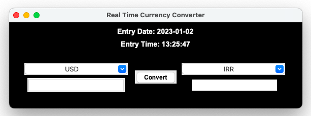

# Real-Time Currency Converter Application



A simple and intuitive desktop application built with Python and Tkinter that provides real-time currency conversion rates.

## Features
* Live exchange rates via ExchangeRate-API.
* Support for multiple global currencies including USD and IRR.
* Built-in input validation to ensure only numbers are entered.
* Displays the exact date and time of the fetched rates.

## Demo Video
You can view a demonstration of the application here: [App Demo Video](demo.mov)

## Installation
1. Clone the repository.
2. Install dependencies: 
   ```bash
   pip install -r requirements.txt
